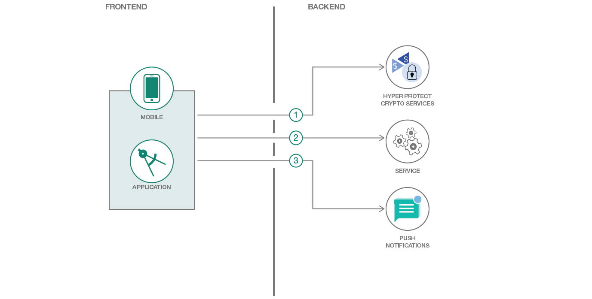
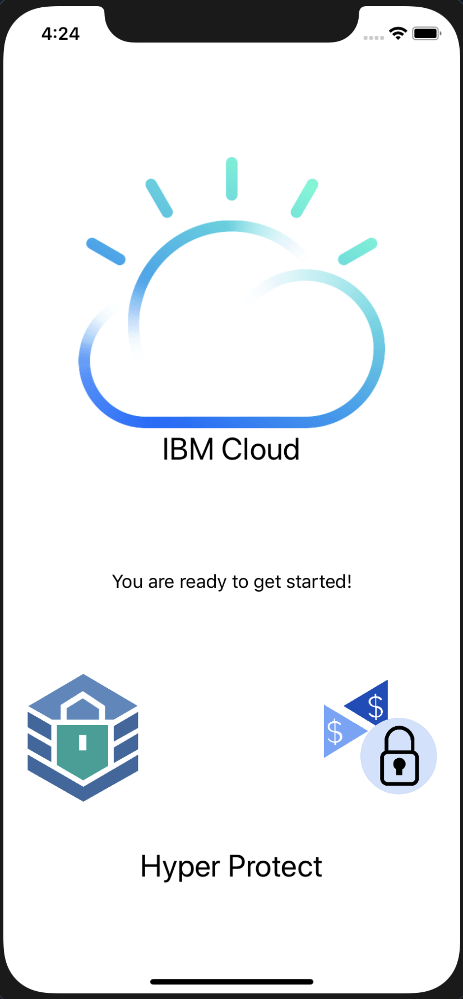

[](https://cloud.ibm.com)
[](https://developer.apple.com/swift/)

# Create an enterprise-ready iOS application with a secure backend for push notifications, cryptography, and authentication

In this code pattern, you will create an enterprise-ready mobile backend as a service (MBaaS) using Swift and Hyper Protect Services. Hyper Protect Services bring continuous security to IBM Cloud, so all data is encrypted in flight, at rest, and in use. You'll essentially have an empty project with more data security than your typical MBaaS, including highly secure push notifications, cryptography, and authentication.

When you have completed this code pattern, you will understand how to:

* Build an iOS application
* Provision and integrate with Push Notifications and Hyper Protect Crypto Services
* Connect to additional IBM Cloud services



## Steps

> As an alternative to the steps below, you can [create this project as a starter kit](https://cloud.ibm.com/developer/appledevelopment/create-app?defaultDeploymentToolchain=&defaultLanguage=IOS_SWIFT&env_id=ibm%3Ayp%3Aus-south&navMode=catalog&starterKit=bee074e4-a6c7-3cfd-b131-8d302942ee0a) on IBM Cloud, which automatically provisions required services, and injects service credentials into a custom fork of this pattern. Then, you can skip directly to step 3 below.

1. [Install development tools](#1-install-development-tools)
2. [Install dependencies](#2-install-dependencies)
3. [Run](#3-run)

### 1. Install development tools

Ensure you have the [required developer tools installed from Apple](https://developer.apple.com/download/):

* iOS 9.0+
* Xcode 9.0
* Swift 4.0

## 2. Install dependencies

The IBM Cloud Mobile services SDK uses [CocoaPods](https://cocoapods.org/) to manage and configure dependencies.

You can install CocoaPods using the following command:

```bash
$ sudo gem install cocoapods
```

If the CocoaPods repository is not configured, run the following command:

```bash
$ pod setup
```

A pre-configured `Podfile` is included in this repository. To download and install the required dependencies, run the following command in your project directory:

```bash
$ pod install
```

Open the Xcode workspace, `{APP_Name}.xcworkspace`. Continue to open the `.xcworkspace` file as it contains all the dependencies and configurations.

If you run into any issues during the pod install, it is recommended to run a pod update by using the following commands:

```bash
$ pod update
$ pod install
```

### 3. Run

Click **Product > Run** to start the app in Xcode. You will see a screen like this:



The application has built in integration points for the Push Notifications, Hyper Protect Crypto, and App ID services.

## License

This code pattern is licensed under the Apache License, Version 2. Separate third-party code objects invoked within this code pattern are licensed by their respective providers pursuant to their own separate licenses. Contributions are subject to the [Developer Certificate of Origin, Version 1.1](https://developercertificate.org/) and the [Apache License, Version 2](https://www.apache.org/licenses/LICENSE-2.0.txt).

[Apache License FAQ](https://www.apache.org/foundation/license-faq.html#WhatDoesItMEAN)
